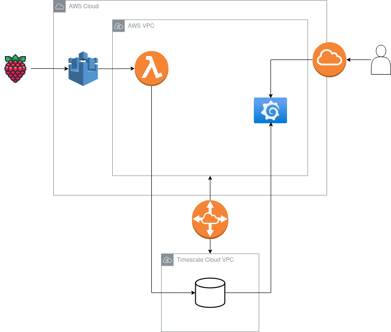
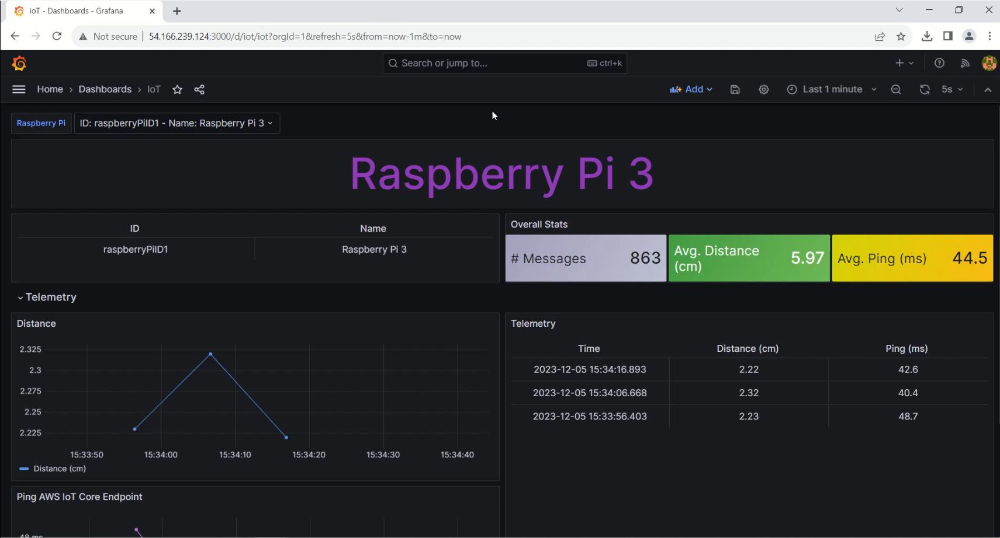
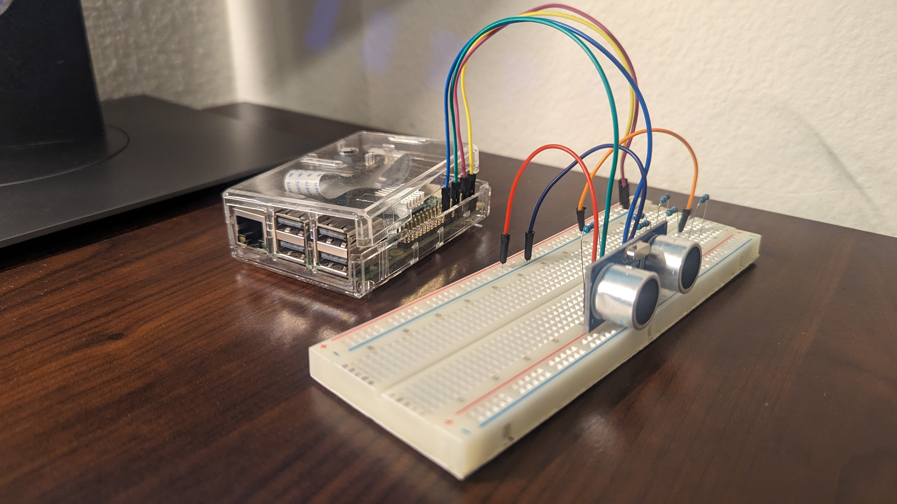
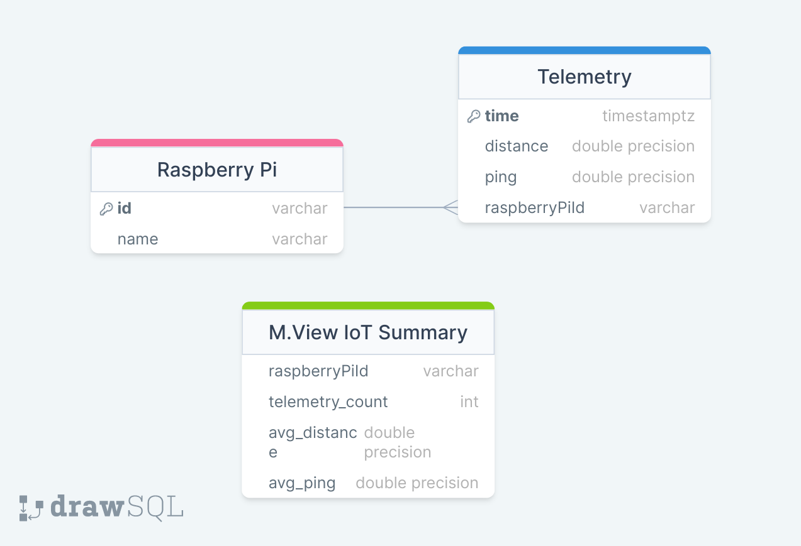

# IoT

Data pipeline for telemetry data from a Raspberry Pi 3 connected to an ultrasonic distance sensor. Pipeline runs on different clouds using VPC peering. 

### Project summary

This project creates a data pipeline combining [AWS IoT Core](https://aws.amazon.com/iot-core/) + [AWS Lambda](https://www.sparkfun.com/products/15569) + [Timescale Cloud](https://www.timescale.com/). The infrastructure on AWS is made using [AWS CloudFormation](https://aws.amazon.com/cloudformation/). The database service runs on Timescale Cloud. The data visualizations are displayed on an interactive dashboard provisioned to a custom [Grafana](https://grafana.com/grafana/) docker image running on [AWS Fargate](https://aws.amazon.com/fargate/). The AWS Lambda functions are deployed using [Serverless](https://www.serverless.com/).

 The Raspberry Pi runs a Python program that measures distance and the ping time to the AWS IoT endpoint. Distance is measured with an ultrasonic distance sensor ([HC-SR04](https://www.sparkfun.com/products/15569)).
 
 The database structure is created using [Sequelize](https://sequelize.org/) models that represent the tables in the database. Unit testing is done using [Mocha](https://mochajs.org/) and [Chai](https://www.chaijs.com/).

#### Cloud infrastructure



### Demo

**Click on the image** to watch the demo video on YouTube
[](https://www.youtube.com/watch?v=fbq8nwANjpo)

Raspberry Pi 3 with HC-SR04 ultrasonic distance sensor 


#### Database schema




### Run on AWS + TimescaleDB Cloud + Raspberry Pi

Follow the guide in [STEPS.md](STEPS.md)

### Run locally

**Pre-requisites:**

- Node.js - 18.x
- npm - 9.8.1
- nvm - 0.39.5
- Docker - 24.0.7, build afdd53b
- Docker compose - v2.21.0

**Steps**

1. Start containers, install packages and load the data:
```console
npm i
npm run docker:up
cd aws-lambda-iot
npm i
npm run setUpDb
npm run loop
```

2. To access Grafana, open on your browser: [localhost:3000](http://localhost:3000)
```
Username: admin
Password: admin
```
3. Interact with the dashboard on Grafana.

4. To stop the containers:
```console
npm run docker:down
```